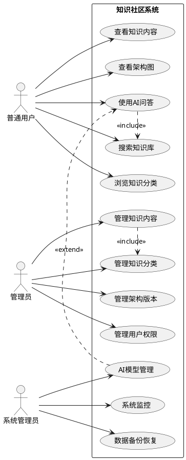

# 知识社区后端系统设计文档

## 1. 系统功能综述

本系统是一个集知识管理、AI问答和用户协作于一体的知识社区平台。系统提供：

### 核心功能模块
- **知识库管理**: 分类知识组织、内容创建与检索
- **ISP架构图管理**: 技术架构版本控制和模块管理  
- **智能搜索**: 混合搜索（关键词+语义搜索）
- **AI知识问答**: 基于知识库的智能问答系统
- **用户权限管理**: 多角色权限控制和用户状态管理
- **实时交互**: WebSocket支持的实时问答会话

## 2. 系统用例图



## 3. 系统架构图

```plantuml
@startuml
!define AWSPREFIX https://raw.githubusercontent.com/awslabs/aws-icons-for-plantuml/v17.0/dist
!includeurl AWSPREFIX/General/allicons.puml
!includeurl AWSPREFIX/Compute/allicons.puml
!includeurl AWSPREFIX/Database/allicons.puml

package "客户端层" {
  [Web浏览器] as WebClient
  [移动应用] as MobileClient
  [API客户端] as APIClient
}

package "API网关层" {
  [负载均衡器] as LoadBalancer
  [API网关] as APIGateway
}

package "应用服务层" {
  [REST API服务] as RESTService
  [WebSocket服务] as WSService
  [认证服务] as AuthService
}

package "业务逻辑层" {
  [知识服务] as KnowledgeService
  [AI问答服务] as AIService
  [搜索服务] as SearchService
  [用户服务] as UserService
  [架构图服务] as FlowService
}

package "数据存储层" {
  [PostgreSQL] as PGDB
  [Redis缓存] as Redis
  [Qdrant向量库] as VectorDB
  [Meilisearch] as SearchEngine
  [对象存储] as ObjectStorage
}

package "外部服务集成" {
  [AI模型服务] as AIModel
  [监控系统] as Monitoring
  [消息队列] as MessageQueue
}

WebClient --> LoadBalancer
MobileClient --> LoadBalancer
APIClient --> LoadBalancer

LoadBalancer --> APIGateway
APIGateway --> RESTService
APIGateway --> WSService
APIGateway --> AuthService

RESTService --> KnowledgeService
RESTService --> AIService
RESTService --> SearchService
RESTService --> UserService
RESTService --> FlowService

WSService --> AIService
AuthService --> UserService

KnowledgeService --> PGDB
KnowledgeService --> Redis
AIService --> VectorDB
AIService --> PGDB
SearchService --> SearchEngine
SearchService --> VectorDB
UserService --> PGDB
FlowService --> PGDB
FlowService --> ObjectStorage

AIService --> AIModel
KnowledgeService --> MessageQueue
SearchService --> MessageQueue

all --> Monitoring

@enduml
```

## 4. 技术选型

### 后端框架
- **主框架**: Rust + Axum (高性能异步Web框架)
- **异步运行时**: Tokio
- **序列化**: Serde + JSON
- **API文档**: OpenAPI 3.0 + Swagger UI

### 数据存储
- **主数据库**: PostgreSQL (关系型数据)
- **缓存**: Redis (会话缓存、速率限制)
- **向量数据库**: Qdrant (语义搜索、AI嵌入)
- **搜索引擎**: Meilisearch (全文搜索)
- **对象存储**: MinIO/S3 (文件存储)

### AI集成
- **模型服务**: OpenAI API + 本地模型备用
- **嵌入模型**: text-embedding-ada-002
- **对话模型**: GPT-4/gpt-3.5-turbo
- **RAG框架**: 自定义检索增强生成

### 基础设施
- **容器化**: Docker + Docker Compose
- **消息队列**: RabbitMQ (异步任务处理)
- **监控**: Prometheus + Grafana
- **日志**: ELK Stack (Elasticsearch, Logstash, Kibana)
- **部署**: Kubernetes (生产环境)

### 开发工具
- **测试框架**: cargo test + Mockito
- **CI/CD**: GitHub Actions
- **代码质量**: Clippy + Rustfmt

## 5. Web API 列表

### 5.1 知识库接口
| 方法 | 端点 | 描述 | 权限 |
|------|------|------|------|
| GET | `/knowledge/categories` | 获取所有知识分类 | 公开 |
| GET | `/knowledge/category/:id` | 获取指定分类详情 | 公开 |
| GET | `/knowledge/item/:id` | 获取指定知识项详情 | 公开 |
| POST | `/knowledge/category` | 创建知识分类 | 管理员 |
| PUT | `/knowledge/category/:id` | 更新知识分类 | 管理员 |
| DELETE | `/knowledge/category/:id` | 删除知识分类 | 管理员 |
| POST | `/knowledge/item` | 创建知识项 | 管理员 |
| PUT | `/knowledge/item/:id` | 更新知识项 | 管理员 |
| DELETE | `/knowledge/item/:id` | 删除知识项 | 管理员 |

### 5.2 ISP架构图接口
| 方法 | 端点 | 描述 | 权限 |
|------|------|------|------|
| GET | `/flow/versions` | 获取所有版本 | 公开 |
| GET | `/flow/version/:id` | 获取指定版本架构图 | 公开 |
| GET | `/flow/module/:id` | 获取指定模块详情 | 公开 |
| POST | `/flow/version` | 创建架构版本 | 管理员 |
| PUT | `/flow/version/:id/status` | 更新版本状态 | 管理员 |
| POST | `/flow/module` | 添加架构模块 | 管理员 |

### 5.3 搜索接口
| 方法 | 端点 | 描述 | 权限 |
|------|------|------|------|
| GET | `/search?q=:query` | 关键词搜索 | 公开 |
| POST | `/search/advanced` | 高级搜索（过滤、排序） | 公开 |
| POST | `/search/semantic` | 语义搜索 | 公开 |
| GET | `/search/suggest?q=:query` | 搜索建议 | 公开 |

### 5.4 AI问答接口
| 方法 | 端点 | 描述 | 权限 |
|------|------|------|------|
| POST | `/ai/ask` | 提交问题获取回答 | 用户 |
| WS | `/ai/chat` | 实时问答聊天 | 用户 |
| GET | `/ai/sessions` | 获取对话会话列表 | 用户 |
| GET | `/ai/session/:id` | 获取会话详情 | 用户 |
| DELETE | `/ai/session/:id` | 删除对话会话 | 用户 |
| POST | `/ai/feedback` | 提交回答反馈 | 用户 |

### 5.5 用户管理接口
| 方法 | 端点 | 描述 | 权限 |
|------|------|------|------|
| GET | `/admin/users` | 获取用户列表 | 管理员 |
| PUT | `/admin/user/:id` | 更新用户信息 | 管理员 |
| POST | `/auth/register` | 用户注册 | 公开 |
| POST | `/auth/login` | 用户登录 | 公开 |
| POST | `/auth/logout` | 用户登出 | 用户 |
| GET | `/auth/profile` | 获取用户资料 | 用户 |

### 5.6 系统管理接口
| 方法 | 端点 | 描述 | 权限 |
|------|------|------|------|
| GET | `/admin/ai/analytics` | AI使用统计分析 | 系统管理员 |
| POST | `/admin/ai/training` | 上传训练数据 | 系统管理员 |
| GET | `/admin/ai/models` | 获取AI模型列表 | 系统管理员 |
| PUT | `/admin/ai/config` | 配置AI参数 | 系统管理员 |
| GET | `/admin/system/health` | 系统健康检查 | 系统管理员 |
| GET | `/admin/system/metrics` | 系统监控指标 | 系统管理员 |

### 5.7 文件管理接口
| 方法 | 端点 | 描述 | 权限 |
|------|------|------|------|
| POST | `/upload` | 文件上传 | 用户 |
| GET | `/file/:id` | 文件下载 | 用户 |
| DELETE | `/file/:id` | 文件删除 | 管理员 |

## 6. 数据模型设计

#### 1. 用户表 (users)
```sql
CREATE TABLE users (
    id SERIAL PRIMARY KEY,
    username VARCHAR(50) UNIQUE NOT NULL,
    email VARCHAR(100) UNIQUE NOT NULL,
    password_hash VARCHAR(255) NOT NULL,
    avatar_url VARCHAR(255),
    role VARCHAR(20) DEFAULT 'user' CHECK (role IN ('user', 'admin', 'system_admin')),
    status VARCHAR(20) DEFAULT 'active' CHECK (status IN ('active', 'inactive', 'banned')),
    last_login_at TIMESTAMP,
    created_at TIMESTAMP DEFAULT CURRENT_TIMESTAMP,
    updated_at TIMESTAMP DEFAULT CURRENT_TIMESTAMP,
    preferences JSONB DEFAULT '{}'::jsonb -- 用户偏好设置
);
```

#### 2. 知识分类表 (knowledge_categories)
```sql
CREATE TABLE knowledge_categories (
    id SERIAL PRIMARY KEY,
    title VARCHAR(100) NOT NULL,
    icon VARCHAR(50), -- 图标名称或URL
    description TEXT,
    color VARCHAR(7) DEFAULT '#3B82F6', -- 分类颜色
    sort_order INTEGER DEFAULT 0,
    is_public BOOLEAN DEFAULT TRUE,
    created_by INTEGER REFERENCES users(id),
    created_at TIMESTAMP DEFAULT CURRENT_TIMESTAMP,
    updated_at TIMESTAMP DEFAULT CURRENT_TIMESTAMP,
    metadata JSONB DEFAULT '{}'::jsonb -- 扩展元数据
);
```

#### 3. 知识项表 (knowledge_items)
```sql
CREATE TABLE knowledge_items (
    id SERIAL PRIMARY KEY,
    title VARCHAR(200) NOT NULL,
    content TEXT NOT NULL,
    excerpt TEXT, -- 内容摘要
    category_id INTEGER REFERENCES knowledge_categories(id),
    tags VARCHAR(50)[], -- 标签数组
    status VARCHAR(20) DEFAULT 'published' CHECK (status IN ('draft', 'published', 'archived')),
    view_count INTEGER DEFAULT 0,
    like_count INTEGER DEFAULT 0,
    featured BOOLEAN DEFAULT FALSE,
    created_by INTEGER REFERENCES users(id),
    created_at TIMESTAMP DEFAULT CURRENT_TIMESTAMP,
    updated_at TIMESTAMP DEFAULT CURRENT_TIMESTAMP,
    published_at TIMESTAMP,
    metadata JSONB DEFAULT '{}'::jsonb -- 扩展元数据
);

-- 为搜索优化创建索引
CREATE INDEX idx_knowledge_items_title ON knowledge_items USING gin(to_tsvector('english', title));
CREATE INDEX idx_knowledge_items_content ON knowledge_items USING gin(to_tsvector('english', content));
CREATE INDEX idx_knowledge_items_tags ON knowledge_items USING gin(tags);
```

#### 4. ISP版本表 (flow_versions)
```sql
CREATE TABLE flow_versions (
    id SERIAL PRIMARY KEY,
    version_name VARCHAR(50) NOT NULL,
    description TEXT,
    diagram_data JSONB NOT NULL, -- 架构图数据
    thumbnail_url VARCHAR(255), -- 缩略图URL
    is_active BOOLEAN DEFAULT FALSE,
    is_public BOOLEAN DEFAULT TRUE,
    created_by INTEGER REFERENCES users(id),
    created_at TIMESTAMP DEFAULT CURRENT_TIMESTAMP,
    updated_at TIMESTAMP DEFAULT CURRENT_TIMESTAMP
);
```

#### 5. ISP模块表 (flow_modules)
```sql
CREATE TABLE flow_modules (
    id SERIAL PRIMARY KEY,
    module_name VARCHAR(100) NOT NULL,
    description TEXT,
    content TEXT,
    module_type VARCHAR(50) DEFAULT 'component', -- 模块类型
    position JSONB, -- 模块在架构图中的位置信息
    version_id INTEGER REFERENCES flow_versions(id),
    parent_module_id INTEGER REFERENCES flow_modules(id), -- 父模块ID
    created_at TIMESTAMP DEFAULT CURRENT_TIMESTAMP,
    updated_at TIMESTAMP DEFAULT CURRENT_TIMESTAMP,
    metadata JSONB DEFAULT '{}'::jsonb -- 扩展元数据
);
```

#### 6. AI问答会话表 (ai_sessions)
```sql
CREATE TABLE ai_sessions (
    id SERIAL PRIMARY KEY,
    user_id INTEGER REFERENCES users(id),
    title VARCHAR(200) DEFAULT 'New Conversation',
    session_type VARCHAR(20) DEFAULT 'general' CHECK (session_type IN ('general', 'technical', 'knowledge')),
    is_active BOOLEAN DEFAULT TRUE,
    created_at TIMESTAMP DEFAULT CURRENT_TIMESTAMP,
    updated_at TIMESTAMP DEFAULT CURRENT_TIMESTAMP
);

-- 为用户会话列表查询优化
CREATE INDEX idx_ai_sessions_user ON ai_sessions(user_id);
CREATE INDEX idx_ai_sessions_updated ON ai_sessions(updated_at DESC);
```

#### 7. AI对话消息表 (ai_messages)
```sql
CREATE TABLE ai_messages (
    id SERIAL PRIMARY KEY,
    session_id INTEGER REFERENCES ai_sessions(id) ON DELETE CASCADE,
    role VARCHAR(20) CHECK (role IN ('user', 'assistant', 'system')),
    content TEXT NOT NULL,
    message_type VARCHAR(20) DEFAULT 'text' CHECK (message_type IN ('text', 'code', 'image', 'file')),
    references INTEGER[], -- 引用的知识项ID数组
    tokens INTEGER DEFAULT 0, -- 消息token数量
    latency INTEGER, -- 响应延迟(ms)
    created_at TIMESTAMP DEFAULT CURRENT_TIMESTAMP,
    
    -- 为会话消息查询优化
    CONSTRAINT fk_session FOREIGN KEY (session_id) REFERENCES ai_sessions(id)
);

CREATE INDEX idx_ai_messages_session ON ai_messages(session_id);
CREATE INDEX idx_ai_messages_created ON ai_messages(created_at);
```

#### 8. 知识向量表 (knowledge_vectors) - AI适配
```sql
CREATE TABLE knowledge_vectors (
    id SERIAL PRIMARY KEY,
    knowledge_item_id INTEGER REFERENCES knowledge_items(id) ON DELETE CASCADE,
    embedding vector(1536), -- OpenAI text-embedding-ada-002 维度
    embedding_model VARCHAR(50) DEFAULT 'text-embedding-ada-002',
    chunk_text TEXT, -- 分块文本内容
    chunk_index INTEGER DEFAULT 0, -- 文本块索引
    created_at TIMESTAMP DEFAULT CURRENT_TIMESTAMP,
    
    -- 向量搜索优化
    CONSTRAINT fk_knowledge_item FOREIGN KEY (knowledge_item_id) REFERENCES knowledge_items(id)
);

-- 为向量搜索创建索引
CREATE INDEX idx_knowledge_vectors_embedding ON knowledge_vectors 
USIVE ivfflat (embedding vector_cosine_ops) WITH (lists = 100);
```

#### 9. AI反馈表 (ai_feedback)
```sql
CREATE TABLE ai_feedback (
    id SERIAL PRIMARY KEY,
    message_id INTEGER REFERENCES ai_messages(id),
    user_id INTEGER REFERENCES users(id),
    rating INTEGER CHECK (rating BETWEEN 1 AND 5),
    feedback_type VARCHAR(50) DEFAULT 'general', -- 反馈类型
    comment TEXT,
    improved_response TEXT, -- 用户建议的改进回答
    created_at TIMESTAMP DEFAULT CURRENT_TIMESTAMP,
    
    CONSTRAINT fk_message FOREIGN KEY (message_id) REFERENCES ai_messages(id),
    CONSTRAINT fk_user FOREIGN KEY (user_id) REFERENCES users(id)
);
```

#### 10. 搜索历史表 (search_history)
```sql
CREATE TABLE search_history (
    id SERIAL PRIMARY KEY,
    user_id INTEGER REFERENCES users(id),
    query TEXT NOT NULL,
    result_count INTEGER DEFAULT 0,
    search_type VARCHAR(20) DEFAULT 'keyword' CHECK (search_type IN ('keyword', 'semantic', 'advanced')),
    filters JSONB DEFAULT '{}'::jsonb, -- 搜索过滤器
    created_at TIMESTAMP DEFAULT CURRENT_TIMESTAMP,
    
    CONSTRAINT fk_user FOREIGN KEY (user_id) REFERENCES users(id)
);

CREATE INDEX idx_search_history_user ON search_history(user_id);
CREATE INDEX idx_search_history_created ON search_history(created_at DESC);
```

#### 11. 用户互动表 (user_interactions) - 用于AI个性化
```sql
CREATE TABLE user_interactions (
    id SERIAL PRIMARY KEY,
    user_id INTEGER REFERENCES users(id),
    interaction_type VARCHAR(50) NOT NULL, -- view, like, search, ask, etc.
    target_id INTEGER, -- 关联的目标ID
    target_type VARCHAR(50), -- knowledge_item, ai_session, etc.
    metadata JSONB DEFAULT '{}'::jsonb,
    created_at TIMESTAMP DEFAULT CURRENT_TIMESTAMP,
    
    CONSTRAINT fk_user FOREIGN KEY (user_id) REFERENCES users(id)
);

CREATE INDEX idx_user_interactions_user ON user_interactions(user_id);
CREATE INDEX idx_user_interactions_type ON user_interactions(interaction_type);
CREATE INDEX idx_user_interactions_created ON user_interactions(created_at DESC);
```

### 索引优化建议

```sql
-- 为常用查询字段创建索引
CREATE INDEX idx_knowledge_items_category ON knowledge_items(category_id);
CREATE INDEX idx_knowledge_items_status ON knowledge_items(status);
CREATE INDEX idx_knowledge_items_created ON knowledge_items(created_at DESC);

CREATE INDEX idx_flow_modules_version ON flow_modules(version_id);
CREATE INDEX idx_flow_versions_active ON flow_versions(is_active);

-- 为全文搜索创建索引
CREATE INDEX idx_knowledge_search ON knowledge_items 
USING gin((setweight(to_tsvector('english', title), 'A') || 
           setweight(to_tsvector('english', content), 'B') || 
           setweight(to_tsvector('english', array_to_string(tags, ' ')), 'C')));
```

这个数据库设计充分考虑了前端React应用的需求，提供了丰富的数据字段来支持复杂的UI展示，同时为AI问答功能做了专门的优化和扩展。

## 7. 安全设计

### 认证授权
- JWT Token认证
- RBAC（基于角色的访问控制）
- API速率限制
- CORS策略配置

### 数据保护
- HTTPS加密传输
- 敏感数据加密存储
- SQL注入防护
- XSS攻击防护

### AI安全
- 输入内容过滤
- 输出内容审查
- 滥用检测机制
- 隐私数据脱敏

这个系统设计提供了完整的知识社区解决方案，结合了传统的内容管理功能和现代的AI能力，确保了系统的可扩展性、安全性和高性能。